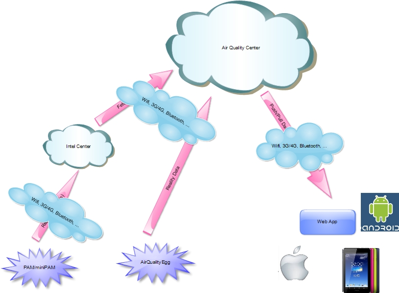
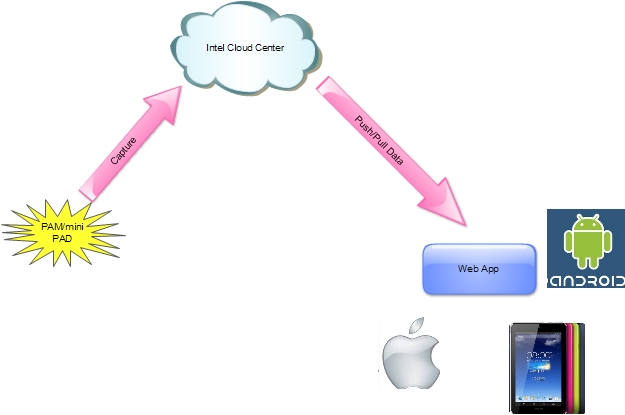
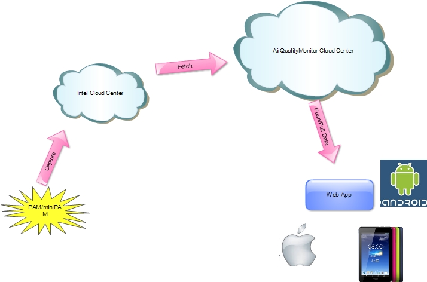
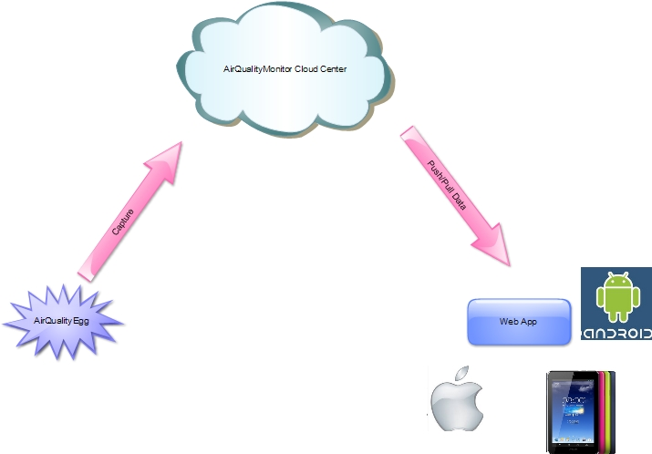

1 引言

1.1 文档用途

该文档适于参加该公益项目的设计人员，开发人员，产品使用者等。

1.2 背景

目前社会生活环境出现了前所未有的恶劣的状况，如雾霾，空气质量差等已对人们工作生活产生了严重的影响。AirQualityMonitor是一个公益性质的项目，目的是想通过科技手段，给我们环境保护的事业前进助绵薄之力。

1.3 缩略语

1.4 参考资料

2 总体设计

2.1 系统体系结构

2.1.1 系统总体设计

2.1.2 三种具体实现方案

 实现方案之一

部件说明：

PAM/miniPAM：

安装在各各采集点，通过这个设备，将采集的数据分配到云端；

Intel Cloud Center：

基于 Intel 现有的云平台，我们实现对采集过来的数据进行分析的算法，并将该算法直接在Intel的云端进行处理，最后可以推式或拉式将数据传递智能终端加以显示！

智能终端：

可支持Web APP，Android，IOS，PAD等，应用相关技术开发应用，实现在开文地图上显示云端分析后的数据；

对数据的显示可有两种方式：推式和拉式。

推式是指将云端分析后的数据主动的向智能终端推送，这种方式还需要记录用户设备及位置信息，推送时，云端可以根据系统中记录的地理位置信息，推送相关设备适当区域的数据，然后加以显示；

拉式是指由用户主动去获取相关设备在适当区域经云端分析之后的数据，然后在智能终端上加以显示。

 实现方案之二

部件说明：

PAM/miniPAM：

安装在各各采集点，通过这个设备，将采集的数据分配到云端；

Intel Cloud Center：

在此方案中，Intel 现有的云平台只做数据的收集及存储，然后转发到AirQualityMonitor Cloud Center。

AirQualityMonitor Cloud Center：

在该方案中，由我们自行搭建一套云平台，该平台负责从Intel Cloud Center提取数据，在该平台上实现对数据分析的算法，最后可以推式或拉式将数据传递智能终端加以显示！
智能终端：

可支持Web APP，Android，IOS，PAD等，应用相关技术开发应用，实现在开文地图上显示云端分析后的数据；

对数据的显示可有两种方式：推式和拉式。

推式是指将云端分析后的数据主动的向智能终端推送，这种方式还需要记录用户设备及位置信息，推送时，云端可以根据系统中记录的地理位置信息，推送相关设备适当区域的数据，然后加以显示；

拉式是指由用户主动去获取相关设备在适当区域经云端分析之后的数据，然后在智能终端上加以显示。

 实现方案之三

Capture Device(Hardware)：

基于开源的AirQualityEgg 自行研发采集设备，部署到现场实时采集现场空气质量的数据，并上传至AirQualityMonitor Cloud Center。

AirQualityMonitor Cloud Center：

在该方案中，由我们自行搭建一套云平台用于数据存储和分析。由采集设备采集的数据实时上传到该平台进行存储，并在该平台上实现对数据分析的算法，最后可以推式或拉式将数据传递智能终端加以显示！
智能终端：

可支持Web APP，Android，IOS，PAD等，应用相关技术开发应用，实现在开文地图上显示云端分析后的数据；

对数据的显示可有两种方式：推式和拉式。

推式是指将云端分析后的数据主动的向智能终端推送，这种方式还需要记录用户设备及位置信息，推送时，云端可以根据系统中记录的地理位置信息，推送相关设备适当区域的数据，然后加以显示；

拉式是指由用户主动去获取相关设备在适当区域经云端分析之后的数据，然后在智能终端上加以显示。

2.2 系统运行体系

2.2.1 运行体系图

2.2.2 程序/模块对应表

2.3 系统物理结构

3 系统接口设计

3.1 用户接口

3.2 外部系统接口

3.3 模块间接口

4 硬件设计

4.1 硬件设计图 

4.2 模块设计

5 云端设计

5.1 待定

5.2 待定

6 UI设计

6.1 UI主界面

6.2 模块设计
